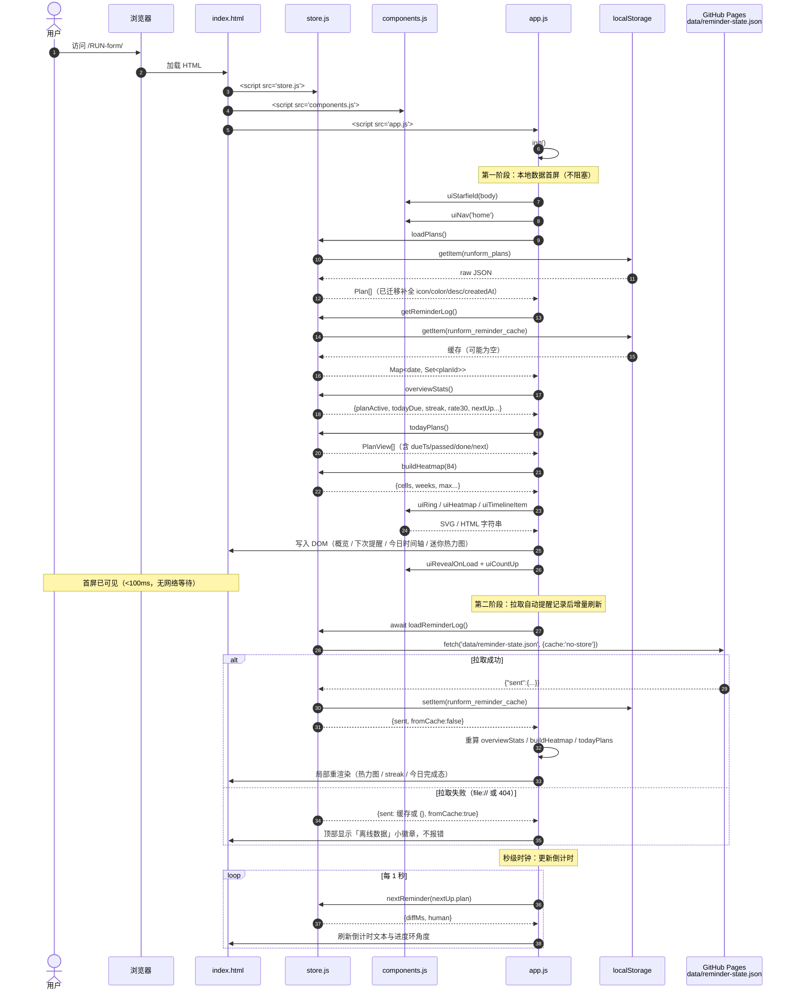
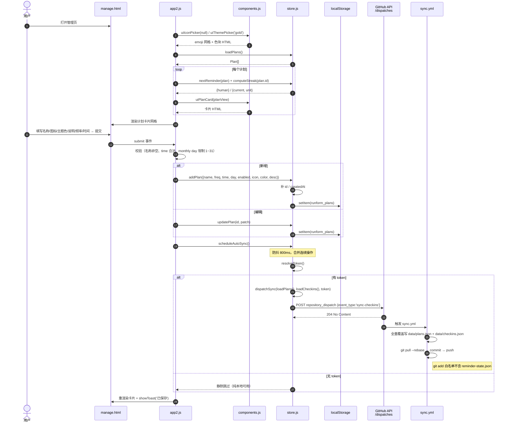
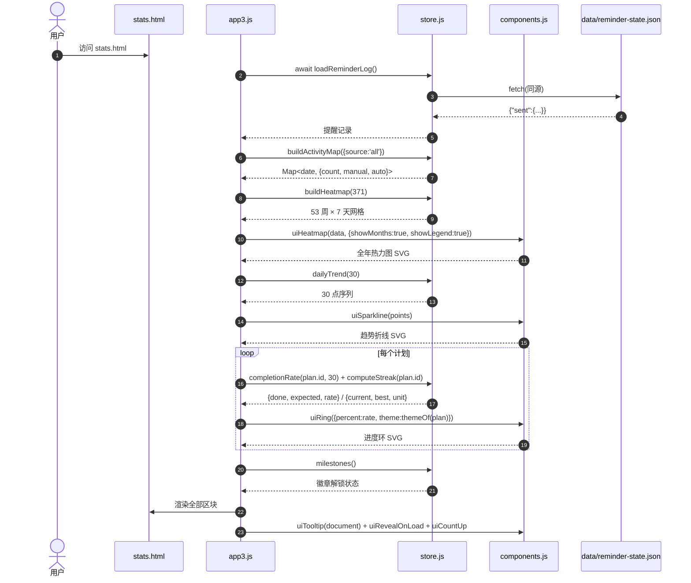
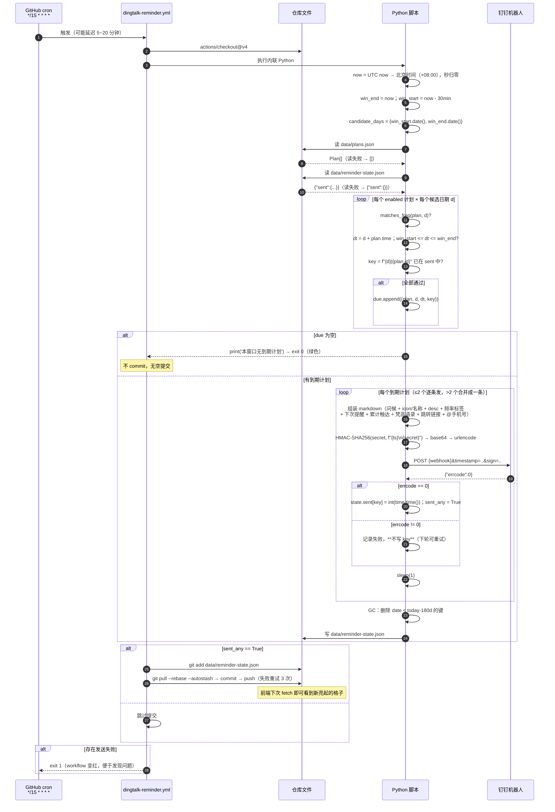
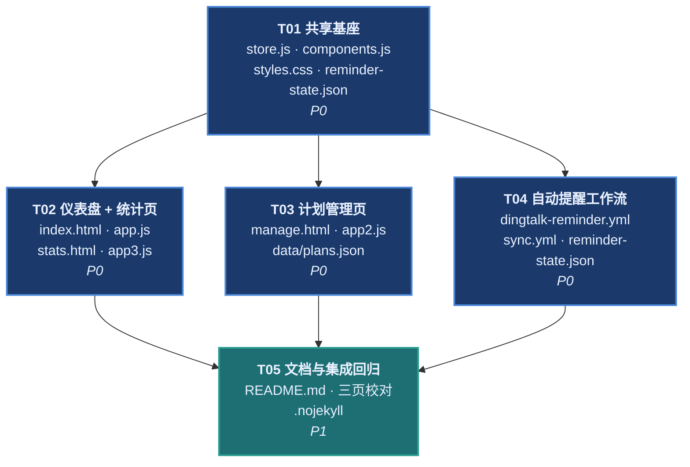

# RUN-form v3 「星河自律」· 系统设计与任务分解

> 架构师：Bob　|　版本：v3.0　|　基线：v2（index/manage 双页 + store.js 共享层 + 每小时 cron 钉钉提醒）
> 核心转向：**从「手动打卡」转为「设定即托管」——计划设进去之后，到点自动推钉钉，网站变成一面「看得见的自律星图」。**

---

## 0. 需求解读与设计立场

用户原话：

> 「把目标计划设进去后，不用再手动打卡说做没做到，每到时间自动推送钉钉消息提醒即可；其余自由发挥，尽量丰富美观、大胆创作。」

拆成三条可执行的架构结论：

| 用户诉求 | 架构结论 |
|---|---|
| 「不用再手动打卡」 | **打卡从「主流程」降级为「可选动作」**。首页第一屏不再是打卡表单，而是**仪表盘**。`addCheckin` 保留（数据向后兼容），但入口收进卡片二级操作。 |
| 「到时间自动推钉钉」 | 提醒精度从「小时」提到「**15 分钟窗口 + 分钟级匹配**」，并引入 `data/reminder-state.json` 做**幂等去重**，避免同一计划一天多推。 |
| 「丰富美观、大胆创作」 | 视觉从 v2 的「浅底白卡」升级为 **深色星空玻璃拟态**；新增**统计页**（热力图 / 趋势 / 完成率环 / 里程碑徽章），全部**手写 SVG + CSS**，零第三方库。 |

### 关键洞察：没有手动打卡，热力图的数据从哪来？

这是 v3 最重要的架构决策。答案：**「提醒已送达」本身就是一条数据。**

`dingtalk-reminder.yml` 每次成功推送都会往 `data/reminder-state.json` 写一条 `"YYYY-MM-DD|planId": epoch`。而站点部署在 **同一个仓库的 GitHub Pages 根目录**，因此前端可以用**同源相对路径** `fetch('data/reminder-state.json')` 直接读到它——**不需要 token、不需要 CORS、不需要后端**。

于是形成一条闭环：

```
浏览器 localStorage(计划)  --sync.yml-->  data/plans.json
                                              |
                                        reminder.yml 读取并推送
                                              |
                                        data/reminder-state.json
                                              |
                            浏览器 fetch 同源读取 --> 热力图 / 连续天数 / 完成率
```

**热力图 = 自动触达记录（青色）+ 可选手动完成（金色）双源叠加。** 用户什么都不做，星图也会自己亮起来。

---

# Part A · 系统设计

## 1. 实现方案（Implementation Approach）

### 1.1 硬约束（不可违背）

| 约束 | 落实方式 |
|---|---|
| 零后端 | 所有状态在 localStorage；只读的自动数据走同源 `fetch('data/*.json')` |
| 无构建步骤 | 纯 `<script src>` 顺序加载，全局函数，**无 import/export、无 type=module** |
| 无外部 CDN / 第三方库 | 图表 = 手写 `<svg>` 字符串；动效 = CSS `@keyframes` + `requestAnimationFrame`；无 Chart.js / 无字体 CDN |
| GitHub Pages `main` 根目录 | 保留 `.nojekyll`；所有资源相对路径，不用绝对 `/` 开头 |
| 向后兼容 v2 | localStorage 键名不变（`runform_plans` / `runform_checkins` / `runform_pat`）；`loadPlans()` / `loadCheckins()` 在读取时做**字段补全式迁移**，老数据零丢失 |

### 1.2 技术难点与解法

| # | 难点 | 解法 |
|---|---|---|
| D1 | **提醒精确到分钟，但 cron 只能定期轮询** | cron 改 `*/15 * * * *`；脚本用「**回溯时间窗**」`[now-30min, now]` 判定，而非精确等值比较。窗口比 cron 间隔宽 2 倍，吸收 GitHub Actions 免费额度的调度抖动（常见延迟 5–20 分钟）。 |
| D2 | **窗口变宽后会重复推送** | 引入 `data/reminder-state.json`，去重键 `"YYYY-MM-DD|planId"`。**只要键存在就跳过**，天然幂等。宽窗口 + 幂等 = 「宁可迟到，不可不到，且绝不重复」。 |
| D3 | **跨天窗口**（如北京时间 00:07 时，窗口起点在昨天 23:37） | 候选日期集合取 `{win_start.date(), win_end.date()}`（跨天时为两天），对**每个候选日期**独立做频率匹配 + 落窗判定。 |
| D4 | **reminder-state.json 会被 sync.yml 清空** | `sync.yml` 的 `git add` 白名单**只含** `data/plans.json data/checkins.json`，且其 Python 脚本只 `open(...,"w")` 这两个文件，物理上不触碰第三个文件。设计上双重保险。 |
| D5 | **两个 workflow 并发 push 冲突** | 两边 push 前统一 `git pull --rebase --autostash origin main`，失败重试 3 次；reminder workflow 加 `concurrency.group` 防自我叠加。 |
| D6 | **无图表库画热力图 / 趋势线** | 热力图 = `<rect>` 网格（53 周 × 7 天），坐标纯算术；趋势线 = `<polyline points="...">`；进度环 = `<circle>` + `stroke-dasharray` / `stroke-dashoffset`。全部由 `components.js` 生成 SVG 字符串。 |
| D7 | **`file://` 本地预览时 fetch 会失败** | `loadReminderLog()` 失败时静默降级：读 localStorage 缓存 `runform_reminder_cache`，再没有就返回空集。**渲染永不因此崩溃。** |
| D8 | **星空动效可能干扰阅读 / 触发前庭不适** | 所有动效包在 `@media (prefers-reduced-motion: no-preference)` 里；`reduce` 分支统一 `animation:none; transition:none`，且 JS 侧的 count-up / 环形填充直接跳终值（见 §10 动效清单）。 |
| D9 | **weekday 编号两套体系** | Python `weekday()` 周一=0；JS `getDay()` 周日=0。v2 的 `plan.day` 沿用 **Python 口径（周一=0）**。JS 侧换算：`jsDow = (plan.day + 1) % 7`。**这是 v3 最容易写错的一行**，已列入共享知识 §14。 |

### 1.3 架构分层

```
┌─────────────────────────────────────────────────────────┐
│  页面层  index.html   manage.html   stats.html          │
│          app.js       app2.js       app3.js             │
│          （render* 函数 + init() IIFE，互不引用）        │
├─────────────────────────────────────────────────────────┤
│  组件层  components.js                                   │
│          ui* 前缀：导航 / 进度环 / 热力图 / 趋势线 /      │
│          emoji 选择器 / 主题色选择器 / countUp / 星空层   │
│          【纯函数：入参 → SVG/HTML 字符串，不碰 store】   │
├─────────────────────────────────────────────────────────┤
│  数据层  store.js                                        │
│          常量 / 模型迁移 / CRUD / 计算（streak、热力图、  │
│          nextReminder、完成率）/ GitHub 同步              │
├─────────────────────────────────────────────────────────┤
│  持久层  localStorage（唯一写入真源）                     │
│          data/*.json（只读镜像 + 提醒状态）               │
└─────────────────────────────────────────────────────────┘
```

**加载顺序铁律**（三个页面都一样，写错就报 `already declared`）：

```html
<script src="store.js"></script>       <!-- 1. 数据 + 常量 -->
<script src="components.js"></script>  <!-- 2. UI 生成器，依赖 store 的常量 -->
<script src="appN.js"></script>        <!-- 3. 页面逻辑 -->
```

### 1.4 三页职责

| 页面 | 定位 | 一句话 |
|---|---|---|
| `index.html` 仪表盘 | **看** | 打开就知道「下一次什么时候、今天还有什么、我坚持了多久」 |
| `manage.html` 管理 | **改** | 计划 CRUD（含 emoji / 主题色 / 说明）+ 同步设置 + 数据备份 + 台账 |
| `stats.html` 统计 | **回望** | 全年热力图 + 30 天趋势 + 每计划完成率 + 里程碑徽章 |

---

## 2. 文件清单（File List）

> 图例：🆕 新建　♻️ 重写　✏️ 修改　✅ 不动

```
RUN-form/
├── index.html                          ♻️  首页 → 仪表盘（结构全换）
├── manage.html                         ♻️  管理页（表单扩展 + 卡片化 + 备份区）
├── stats.html                          🆕  统计页
├── styles.css                          ♻️  星空玻璃拟态设计系统（全量重写）
├── store.js                            ♻️  数据层 v3（v2 全部函数保留 + 新增计算/主题/语录）
├── components.js                       🆕  共享 UI 生成器（SVG 图表 / 选择器 / 导航）
├── app.js                              ♻️  仪表盘逻辑
├── app2.js                             ♻️  管理页逻辑
├── app3.js                             🆕  统计页逻辑
├── .nojekyll                           ✅  保留（空文件，禁 Jekyll）
├── data/
│   ├── plans.json                      ✅  结构扩展但文件由 sync.yml 生成，仓库里保持 []
│   ├── checkins.json                   ✅  同上
│   └── reminder-state.json             🆕  提醒去重状态，初始内容 {"sent":{},"updatedAt":0}
├── assets/
│   └── bg-vangogh-ocean.webp           ✅  沿用 v2 背景油画（作为星空底层）
├── .github/workflows/
│   ├── dingtalk-reminder.yml           ♻️  15 分钟窗口 + 幂等去重 + 富消息（全量重写）
│   └── sync.yml                        ✏️  仅加 rebase 重试 + 白名单注释，逻辑不变
├── docs/
│   ├── system_design.md                🆕  本文件
│   ├── class-diagram.mermaid           🆕
│   └── sequence-diagram.mermaid        🆕
└── README.md                           ♻️  v3 说明（新数据流 / 新提醒机制 / 三页导览）
```

**共 14 个文件：新建 6、重写 7、修改 1。**

---

## 3. 数据结构与接口

### 3.1 Plan 模型（v3）

```jsonc
{
  "id":        "9f2c...",     // string  唯一 id，genId() 生成                 【v2 已有】
  "name":      "晨跑",         // string  计划名，也是钉钉消息主标题             【v2 已有】
  "freq":      "daily",       // 'daily' | 'weekly' | 'monthly'              【v2 已有】
  "time":      "07:00",       // string  'HH:MM'，北京时间                     【v2 已有】
  "day":       0,             // number  weekly=星期号(周一=0)；monthly=1~31   【v2 已有】
  "enabled":   true,          // boolean 关掉则不提醒、不计入统计              【v2 已有】

  "icon":      "🏃",          // string  单个 emoji，来自 ICON_PRESETS 或自填   【v3 新增】
  "color":     "gold",        // string  主题键，COLOR_THEMES 的 key           【v3 新增】
  "desc":      "沿江 3 公里",  // string  可选一句话说明，进钉钉消息引用块        【v3 新增】
  "createdAt": 1733000000000  // number  创建时间戳，用于「已坚持 N 天」        【v3 新增】
}
```

**迁移规则（`loadPlans()` 内联执行，读时补全，不改写 localStorage 直到下次 save）：**

| 字段 | 缺省值 |
|---|---|
| `icon` | `"🌟"` |
| `color` | `COLOR_KEYS[hashString(id) % COLOR_KEYS.length]` —— 按 id 哈希派生，**同一计划每次都是同一个颜色**，老计划自动获得五彩缤纷的外观 |
| `desc` | `""` |
| `createdAt` | 该计划在数组中的位置反推的伪时间，或 `Date.now()`（保证是有限数） |

> ⚠️ 兼容性保证：v3 写出的 plan 对象对 v2 的 `describePlan()` / 钉钉脚本完全可读（多余字段被忽略）；v2 写出的 plan 对象被 v3 读取时自动补全。**双向兼容。**

### 3.2 Checkin 模型（v3）

```jsonc
{
  "id":       "3a1b...",      // string                                      【v2 已有】
  "planId":   "9f2c...",      // string|null  历史迁移记录为 null             【v2 已有】
  "planName": "晨跑",          // string  展示内容                            【v2 已有】
  "ts":       1733011200000,  // number  毫秒时间戳                           【v2 已有】
  "note":     "",             // string  恒为空串（v2 约定，保留占位）         【v2 已有】

  "planIcon": "🏃",           // string  冗余存快照，计划删掉后台账仍有图标     【v3 新增】
  "source":   "manual"        // 'manual' | 'auto'                          【v3 新增】
}
```

**迁移规则**：`planIcon` 缺省 `"✅"`（若能按 `planId` 反查到现存计划则取其 `icon`）；`source` 缺省 `"manual"`。

### 3.3 ReminderState 模型（仓库文件，Actions 写 / 前端只读）

`data/reminder-state.json`：

```jsonc
{
  "sent": {
    "2026-08-06|9f2c-...": 1754460000,   // key = "YYYY-MM-DD|planId"（北京时间日期）
    "2026-08-06|1e7d-...": 1754463600,   // value = 发送时刻的 epoch 秒（UTC）
    "2026-08-05|9f2c-...": 1754373600
  },
  "updatedAt": 1754463600                 // 最后一次写入的 epoch 秒
}
```

- **保留期 180 天**：每次写入时 GC 掉 `date < today-180d` 的键。10 个计划 × 180 天 ≈ 1800 键 ≈ 55 KB，对仓库无压力，同时够画满一整年热力图的自动数据。
- **前端只读**，绝不写；写入方唯一为 `dingtalk-reminder.yml`。

### 3.4 store.js 常量（v3 新增）

```js
/** 提醒状态文件的同源相对路径 */
const REMINDER_STATE_URL = "data/reminder-state.json";
/** 提醒状态的本地缓存键（fetch 失败时降级读它） */
const REMINDER_CACHE_KEY = "runform_reminder_cache";
/** UI 偏好设置键（是否显示手动完成按钮、是否开启动效等） */
const PREFS_KEY = "runform_prefs";

/** 主题色板：key → 渐变与光晕。与 styles.css 的 .theme-<key> 一一对应 */
const COLOR_THEMES = {
  gold:   { label: "麦田金", from: "#f2c14e", to: "#e0a82e", glow: "242,193,78"  },
  blue:   { label: "星夜蓝", from: "#4a86d8", to: "#1b3a6b", glow: "74,134,216"  },
  teal:   { label: "海潮青", from: "#2a9d8f", to: "#1d6f74", glow: "42,157,143"  },
  violet: { label: "暮夜紫", from: "#8b7ae8", to: "#4b3f9e", glow: "139,122,232" },
  rose:   { label: "杏花粉", from: "#e58ba6", to: "#a13b5e", glow: "229,139,166" },
  amber:  { label: "落日橙", from: "#f0954a", to: "#b4551a", glow: "240,149,74"  },
};
const COLOR_KEYS = Object.keys(COLOR_THEMES);

/** emoji 图标预设（管理页选择器用，32 个，4 组 × 8） */
const ICON_PRESETS = [
  "🏃","🚶","🏋️","🧘","🚴","🏊","⛹️","🤸",   // 运动
  "📖","✍️","💻","🎨","🎹","🎸","🧠","🌱",   // 学习创作
  "💧","🍎","🥗","💊","😴","☕","🦷","🧴",   // 健康
  "🧹","🧺","💰","📞","🐕","⏰","🎯","🌙",   // 生活
];

/** 梵高书信风格鼓励语（钉钉消息与仪表盘共用） */
const VAN_GOGH_QUOTES = [
  "我梦见我的画，然后我画我的梦。",
  "伟大的事，由一系列小事汇聚而成。",
  "如果心里有个声音说「你做不到」，那就去做，那个声音自会沉默。",
  "我总在追寻，却从不到达；我总在跋涉，却从不停息。",
  "星星让我做梦。",
  "我宁愿死于热情，也不愿死于无聊。",
  "普通的日子里，也藏着值得画下来的光。",
  "别灰心，明天太阳照常升起，而我们照常出发。",
  "去爱尽可能多的事物，真正的力量就藏在那里。",
  "我心中有一团火，路过的人只看到烟。",
  "画家不该被画布上的空白吓倒。",
  "只要还在走，路就没有尽头。",
];

/** 热力图分档阈值：count >= 阈值 即进入该档（从高到低匹配） */
const HEATMAP_LEVELS = [0, 1, 2, 4, 6];   // → level 0/1/2/3/4

/** 里程碑徽章定义（统计页用） */
const MILESTONES = [
  { days: 7,   icon: "🌱", name: "破土",   desc: "连续 7 天"   },
  { days: 21,  icon: "🌿", name: "成习",   desc: "连续 21 天"  },
  { days: 30,  icon: "🌻", name: "向日葵", desc: "连续 30 天"  },
  { days: 100, icon: "🌌", name: "星河",   desc: "连续 100 天" },
  { days: 365, icon: "👑", name: "岁轮",   desc: "连续 365 天" },
];

/** 时段问候（钉钉与仪表盘共用），按北京时间小时取 */
const GREETINGS = [
  { from: 5,  to: 8,  emoji: "🌅", text: "早安" },
  { from: 9,  to: 11, emoji: "☀️", text: "上午好" },
  { from: 12, to: 13, emoji: "🌻", text: "午安" },
  { from: 14, to: 17, emoji: "🌤", text: "下午好" },
  { from: 18, to: 21, emoji: "🌌", text: "晚上好" },
  { from: 22, to: 4,  emoji: "🌙", text: "夜深了" },   // 跨零点区间
];
```

### 3.5 store.js 函数签名（v3 新增 / 变更）

> v2 已有且**签名不变**的：`genId` `escapeHtml` `formatTime` `showToast` `loadPlans` `savePlans` `addPlan` `updatePlan` `deletePlan` `togglePlan` `loadCheckins` `saveCheckins` `addCheckin` `deleteCheckin` `clearAll` `resolveToken` `dispatchSync` `scheduleAutoSync` `syncToRepo` `describePlan`
> （`addPlan` / `addCheckin` 内部扩展了新字段，但**调用方式完全兼容**。）

#### 3.5.1 工具

| 签名 | 职责 |
|---|---|
| `hashString(str) -> number` | 简易 DJB2 哈希，返回非负整数。用于按 id 稳定派生主题色。 |
| `dateKey(input) -> string` | 任意 `Date`/时间戳 → 本地时区 `'YYYY-MM-DD'`。**全站日期归一化唯一入口。** |
| `parseHHMM(time) -> {h:number, m:number}` | `'07:30'` → `{h:7,m:30}`；非法输入兜底 `{h:8,m:0}`。 |
| `startOfDay(input) -> Date` | 归一到当天 00:00:00.000。 |
| `daysBetween(a, b) -> number` | 两个日期相差的整天数（按 `startOfDay` 计）。 |
| `themeOf(plan) -> {key,label,from,to,glow}` | 取计划主题；`plan.color` 非法时按 `hashString(plan.id)` 派生。 |
| `greetingNow(date?) -> {emoji,text}` | 按小时返回时段问候。 |
| `randomQuote(seed?) -> string` | 从 `VAN_GOGH_QUOTES` 取一条；传 `seed`（如 `dateKey()`）时**当天恒定**，不传则真随机。 |
| `formatCountdown(ms) -> string` | `→ "3 小时 12 分"` / `"18 分钟"` / `"已到时间"`。 |
| `loadPrefs() -> Object` / `savePrefs(patch) -> void` | UI 偏好读写（`showManualCheckin:boolean`、`heatmapSource:'all'\|'auto'\|'manual'`）。 |

#### 3.5.2 计划调度计算

```js
/**
 * 判断某个计划在给定日期是否「应当触发」。
 * @param {Object} plan
 * @param {Date|string|number} date
 * @returns {boolean}
 * 规则：daily 恒真；weekly 需 pyWeekday(date)===plan.day；
 *       monthly 需 date.getDate()===min(plan.day, 当月最后一天)（短月兜底）。
 *       plan.enabled===false 时恒假。
 */
function isPlanDueOn(plan, date)

/**
 * 计算某计划从 fromTs 起的下一次提醒时刻。
 * @param {Object} plan
 * @param {number} [fromTs=Date.now()]
 * @returns {{ts:number, dateKey:string, human:string, diffMs:number, isToday:boolean}|null}
 *          plan.enabled===false 或找不到（理论不会）时返回 null。
 * human 形如："今天 07:00" / "明天 07:00" / "周四 07:00（3 天后）" / "9 月 1 日 07:00"
 * 实现：daily 最多看 2 天；weekly 最多看 8 天；monthly 逐月构造，最多看 13 个月。
 */
function nextReminder(plan, fromTs)

/**
 * 列出某计划在 [fromTs, toTs] 区间内所有「应当触发」的日期。
 * @returns {string[]} 升序的 'YYYY-MM-DD' 数组。用作完成率的分母、streak 的回溯序列。
 */
function planDueDates(plan, fromTs, toTs)

/**
 * 今日视图：今天应当触发的计划，按时间升序，并附加运行时状态。
 * @returns {Array<Object>} 每项 = { ...plan, dueTs, dueTime, passed, done, next, theme }
 *   dueTs   今日触发时刻的时间戳
 *   passed  该时刻是否已过去
 *   done    今天是否已有活动记录（自动提醒送达 或 手动打卡）
 */
function todayPlans()
```

#### 3.5.3 活动数据与统计

```js
/**
 * 异步拉取 data/reminder-state.json（同源），成功后写入 localStorage 缓存并更新内存。
 * 失败（file:// / 404 / 网络）时静默降级读缓存，绝不抛错。
 * @returns {Promise<{sent:Object, fromCache:boolean, fetchedAt:number}>}
 */
async function loadReminderLog()

/**
 * 同步读取当前内存/缓存中的提醒记录，供渲染函数直接使用。
 * @returns {Map<string, Set<string>>}  dateKey → Set<planId>
 */
function getReminderLog()

/**
 * 汇总「活动日历」：手动打卡 + 自动提醒送达。
 * @param {{planId?:string, source?:'all'|'auto'|'manual'}} [opts]
 * @returns {Map<string, {count:number, manual:number, auto:number, plans:Set<string>}>}
 *          key = 'YYYY-MM-DD'
 */
function buildActivityMap(opts)

/**
 * 构建热力图数据（GitHub 风格：按周分列，周一在上）。
 * @param {number} [days=182]  回溯天数（仪表盘 84 ≈ 12 周；统计页 371 ≈ 53 周）
 * @param {{planId?:string, source?:string}} [opts]
 * @returns {{
 *   cells: Array<{date:string, ts:number, count:number, level:number,
 *                 manual:number, auto:number, col:number, row:number}>,
 *   weeks:number, max:number, total:number, activeDays:number,
 *   startDate:string, endDate:string, monthTicks:Array<{col:number,label:string}>
 * }}
 * level 由 HEATMAP_LEVELS 定档；row = pyWeekday(0..6)；col = 第几周（0 起）。
 */
function buildHeatmap(days, opts)

/**
 * 计算某计划的连续记录。
 * 语义：按「该计划的应触发日序列」回溯，而非自然日——
 *   daily 计「连续 N 天」，weekly 计「连续 N 周」，monthly 计「连续 N 月」。
 * 今日若尚未到点，从上一个应触发日开始回溯（不因「今天还没到」判断中断）。
 * @param {string} planId
 * @returns {{current:number, best:number, unit:'天'|'周'|'月', lastDate:string|null}}
 */
function computeStreak(planId)

/**
 * 全站总连续天数（任意计划有活动即算「这一天亮着」），仪表盘顶部指标用。
 * @returns {{current:number, best:number}}
 */
function globalStreak()

/**
 * 计算某计划在最近 days 天的完成率。
 * @param {string} planId
 * @param {number} [days=30]
 * @returns {{done:number, expected:number, missed:number, rate:number}}  rate ∈ [0,1]
 */
function completionRate(planId, days)

/**
 * 仪表盘顶部概览指标。
 * @returns {{
 *   planTotal:number, planActive:number,
 *   todayDue:number, todayDone:number,
 *   streak:number, streakBest:number,
 *   rate30:number, totalActive:number,
 *   nextUp:{plan:Object, info:Object}|null
 * }}
 */
function overviewStats()

/**
 * 近 N 天每日活动数，供统计页趋势折线使用。
 * @param {number} [days=30]
 * @returns {Array<{date:string, count:number, label:string}>}
 */
function dailyTrend(days)

/**
 * 已解锁的里程碑徽章。
 * @returns {Array<{...MILESTONES项, unlocked:boolean, progress:number}>}
 */
function milestones()
```

#### 3.5.4 备份 / 恢复（管理页新增）

```js
/**
 * 导出全量数据为 JSON 字符串（计划 + 台账 + 偏好，不含 token）。
 * @returns {string}  {version:3, exportedAt, plans:[], checkins:[], prefs:{}}
 */
function exportData()

/**
 * 从 JSON 字符串导入并覆盖本地数据。
 * @param {string} json
 * @param {{merge?:boolean}} [opts]  merge=true 时按 id 合并，false 时整体覆盖
 * @returns {{plans:number, checkins:number}} 导入条数
 * @throws {Error} 解析失败或结构非法时抛出可直接展示的错误
 */
function importData(json, opts)
```

### 3.6 components.js 函数签名（全新）

> **纯函数**：入参 → 返回 HTML/SVG **字符串**（或对 DOM 做一次性挂载）。**不读 localStorage、不调用 store 的 load\*，只接收已算好的数据。**
> **命名前缀统一 `ui`。内部禁止声明 `$`**（页面脚本已占用该名），一律用 `document.querySelector`。

| 签名 | 职责 |
|---|---|
| `uiNav(active) -> string` | 生成三页顶部胶囊导航 HTML，`active ∈ 'home'\|'manage'\|'stats'`，当前项加 `.is-active`。 |
| `uiStarfield(container)` | 向容器注入 3 层星空 `<div>`（不同密度/速度做视差），仅做一次。星点位置用固定种子随机生成，避免每次刷新跳变。 |
| `uiRing({percent, size, stroke, theme, label, sub}) -> string` | 生成进度环 SVG。`stroke-dasharray = C`，`stroke-dashoffset = C*(1-percent)`；带 `data-target` 供动效延迟填充。 |
| `uiHeatmap(data, {cell, gap, showMonths, showLegend}) -> string` | 由 `buildHeatmap()` 结果生成 SVG 网格。每个 `<rect>` 带 `data-date` / `data-count` 供 tooltip。 |
| `uiSparkline(points, {width, height, theme}) -> string` | 由 `dailyTrend()` 结果生成折线 + 渐变填充区 SVG（`<polyline>` + `<polygon>`）。 |
| `uiIconPicker(selected) -> string` | 32 格 emoji 网格 + 自定义输入框，radio 语义。 |
| `uiThemePicker(selected) -> string` | 6 个渐变色块 swatch，radio 语义。 |
| `uiPlanCard(planView) -> string` | 管理页计划卡片（icon / 名称 / 描述 / 频率 / 下次提醒 / streak 徽章 / 开关 / 编辑 / 删除）。 |
| `uiTimelineItem(planView) -> string` | 仪表盘今日时间轴单项（时间刻度 + 状态点 + 计划信息）。 |
| `uiCountUp(el, target, {duration, decimals})` | `requestAnimationFrame` 数字滚动；`prefers-reduced-motion: reduce` 时直接赋终值。 |
| `uiTooltip(root)` | 为 `root` 内所有 `[data-tip]` 元素挂载轻量 tooltip（单例浮层，不用第三方库）。 |
| `uiRevealOnLoad(root)` | 给 `root` 的直接子元素按序加 `.reveal` 类做 stagger 进场；`reduce` 时直接可见。 |

---

## 4. 程序调用流程（时序图）

> 同时存于 `docs/sequence-diagram.mermaid`。

### 4.1 首页仪表盘加载



### 4.2 管理页计划 CRUD → 自动同步



### 4.3 统计页聚合



### 4.4 钉钉自动提醒（GitHub Actions）



---

## 5. GitHub Actions 规格

### 5.1 `dingtalk-reminder.yml`（全量重写）

#### 5.1.1 Workflow 骨架

```yaml
name: 钉钉自动提醒

on:
  schedule:
    - cron: "*/15 * * * *"        # 每 15 分钟（UTC，脚本内换算北京时间）
  workflow_dispatch:
    inputs:
      dry_run:
        description: "只打印不发送，也不写状态"
        type: boolean
        default: false
      force_plan_id:
        description: "强制推送指定 planId（忽略时间窗与去重，仅供调试）"
        type: string
        default: ""

permissions:
  contents: write                  # 需要写 data/reminder-state.json

concurrency:
  group: dingtalk-reminder         # 防止上一轮没跑完就叠加下一轮
  cancel-in-progress: false

jobs:
  remind:
    runs-on: ubuntu-latest
    steps:
      - uses: actions/checkout@v4
        with:
          persist-credentials: true
      - name: 匹配到期计划并推送
        id: push
        env:
          DINGTALK_WEBHOOK:   ${{ secrets.DINGTALK_WEBHOOK }}
          DINGTALK_SECRET:    ${{ secrets.DINGTALK_SECRET }}
          DINGTALK_AT_MOBILES: ${{ secrets.DINGTALK_AT_MOBILES }}   # 可选，逗号分隔
          SITE_URL: "https://chenliguan42057.github.io/RUN-form/"
          DRY_RUN:  ${{ inputs.dry_run }}
          FORCE_ID: ${{ inputs.force_plan_id }}
        run: python3 - <<'PY'
          ...（见 5.1.2）
          PY
      - name: 提交提醒状态
        if: steps.push.outputs.sent_any == 'true'
        run: |
          ...（见 5.1.4）
```

#### 5.1.2 Python 核心逻辑（可落地伪码，保持 v2 风格：标准库 + 中文注释）

```python
import os, json, time, hmac, hashlib, base64, calendar, random, urllib.parse, urllib.request
from datetime import datetime, timedelta, timezone, date as _date, time as _time

# ---------------- 常量 ----------------
BJ = timezone(timedelta(hours=8))          # 北京时区
WINDOW_MIN = 30                            # 回溯时间窗（分钟）。比 cron 间隔宽一倍，吸收调度抖动
RETAIN_DAYS = 180                          # reminder-state 保留天数
STATE_PATH = "data/reminder-state.json"
PLANS_PATH = "data/plans.json"

FREQ_LABELS = {"daily": "每日", "weekly": "每周", "monthly": "每月"}
WEEKDAY_LABELS = ["周一", "周二", "周三", "周四", "周五", "周六", "周日"]

QUOTES = [ ...与 store.js 的 VAN_GOGH_QUOTES 完全一致（12 条）... ]
GREETINGS = [(5,8,"🌅","早安"), (9,11,"☀️","上午好"), (12,13,"🌻","午安"),
             (14,17,"🌤","下午好"), (18,21,"🌌","晚上好")]   # 其余小时 → ("🌙","夜深了")

# ---------------- 工具 ----------------
def safe_int(v, default=0):
    """把任意值安全转成 int，失败返回 default（v2 已有的防红逻辑，保留）"""

def parse_hhmm(s):
    """'07:30' → (7,30)；非法输入返回 (8,0)"""

def read_json(path, fallback):
    """读 JSON，任何异常都返回 fallback，绝不让 workflow 因文件问题变红"""

def matches_freq(plan, d):
    """
    判断计划 plan 在日期 d（datetime.date）是否应触发。
    daily   → True
    weekly  → d.weekday() == plan.day        （周一=0，与前端 plan.day 口径一致）
    monthly → d.day == min(max(plan.day,1), calendar.monthrange(d.year, d.month)[1])
              ← 短月兜底，沿用 v2 的 monthrange 写法
    """

def greeting_of(hour):
    """按小时返回 (emoji, text)"""

def next_reminder_human(plan, after_dt):
    """
    计算 after_dt 之后的下一次触发时刻，返回中文描述。
    与前端 nextReminder() 规则完全一致（daily 看 2 天 / weekly 看 8 天 / monthly 看 13 月）。
    返回形如 "明天 07:00" / "周四 07:00" / "9 月 1 日 07:00"
    """

# ---------------- 主流程 ----------------
now = datetime.now(timezone.utc).astimezone(BJ).replace(second=0, microsecond=0)
win_end   = now
win_start = now - timedelta(minutes=WINDOW_MIN)
# 跨天时候选日期是两天（例：now=00:07 → {昨天, 今天}）
candidate_days = sorted({win_start.date(), win_end.date()})

plans = read_json(PLANS_PATH, [])
plans = [p for p in plans if isinstance(p, dict)]
state = read_json(STATE_PATH, {"sent": {}})
sent  = state.get("sent") if isinstance(state.get("sent"), dict) else {}

force_id = os.environ.get("FORCE_ID", "").strip()
dry_run  = os.environ.get("DRY_RUN", "false").lower() == "true"

due = []
for p in plans:
    if force_id:
        # 调试模式：只认 id，忽略窗口与去重
        if p.get("id") == force_id:
            due.append((p, now.date(), now, f"{now.date().isoformat()}|{p.get('id')}"))
        continue

    if not p.get("enabled"):
        continue
    hh, mm = parse_hhmm(p.get("time", "08:00"))

    for d in candidate_days:
        if not matches_freq(p, d):
            continue
        dt = datetime.combine(d, _time(hh, mm), tzinfo=BJ)
        if not (win_start <= dt <= win_end):
            continue
        key = f"{d.isoformat()}|{p.get('id')}"
        if key in sent:                      # ★ 幂等：今天这个计划已推过就跳过
            continue
        due.append((p, d, dt, key))

if not due:
    print(f"[{now:%Y-%m-%d %H:%M}] 窗口 {win_start:%H:%M}~{win_end:%H:%M} 内无到期计划，跳过")
    # 通过 GITHUB_OUTPUT 输出 sent_any=false，让提交步骤被 if 条件跳过（避免空提交）
    with open(os.environ["GITHUB_OUTPUT"], "a") as f:
        f.write("sent_any=false\n")
    raise SystemExit(0)
```

#### 5.1.3 富消息模板与签名

**签名（沿用 v2，一字不改）：**

```python
def signed_url(webhook, secret):
    ts = str(round(time.time() * 1000))
    string_to_sign = f"{ts}\n{secret}"
    sign = base64.b64encode(
        hmac.new(secret.encode("utf-8"), string_to_sign.encode("utf-8"), hashlib.sha256).digest()
    ).decode("utf-8")
    return f"{webhook}&timestamp={ts}&sign={urllib.parse.quote_plus(sign)}"
```

**单计划消息（`len(due) <= 2` 时逐条发送，每条间隔 1 秒）：**

```python
def build_single_md(plan, d, dt, now, sent):
    emoji, hello = greeting_of(now.hour)
    icon  = plan.get("icon") or "🌟"
    name  = plan.get("name") or "未命名"
    desc  = (plan.get("desc") or "").strip()
    freq  = FREQ_LABELS.get(plan.get("freq"), "每日")
    # 频率标签细化：weekly 带星期，monthly 带日期
    if plan.get("freq") == "weekly":
        freq = f"每周 · {WEEKDAY_LABELS[safe_int(plan.get('day'))%7]}"
    elif plan.get("freq") == "monthly":
        freq = f"每月 {safe_int(plan.get('day'),1)} 日"

    delay = int((now - dt).total_seconds() // 60)
    delay_note = f"（延迟 {delay} 分钟送达）" if delay > 5 else ""

    # 累计触达：从 state 里数该 planId 出现过多少次
    total = sum(1 for k in sent if k.endswith("|" + plan.get("id", "")))
    month_prefix = f"{d:%Y-%m}"
    month_cnt = sum(1 for k in sent
                    if k.startswith(month_prefix) and k.endswith("|" + plan.get("id", "")))

    quote = random.choice(QUOTES)
    nxt   = next_reminder_human(plan, dt)
    site  = os.environ["SITE_URL"]

    lines = [
        f"### {emoji} {hello}",
        "",
        f"# {icon} {name}",
    ]
    if desc:
        lines += ["", f"> {desc}"]
    lines += [
        "",
        f"- 🕒 **原定时间**　{plan.get('time','08:00')} {delay_note}",
        f"- 🔁 **提醒频率**　{freq}",
        f"- ⏭️ **下次提醒**　{nxt}",
        f"- 🔥 **累计触达**　本月 {month_cnt+1} 次 · 总计 {total+1} 次",
        "",
        "---",
        f"> *{quote}*",
        "",
        f"[🌌 打开「星河自律」查看星图 →]({site})",
    ]
    return "\n".join(lines)
```

**多计划合并消息（`len(due) > 2`）：**

```python
def build_batch_md(due, now):
    emoji, hello = greeting_of(now.hour)
    site = os.environ["SITE_URL"]
    lines = [f"### {emoji} {hello}", "",
             f"# 🌌 这个时段有 {len(due)} 件事在等你", ""]
    for p, d, dt, key in due:
        icon = p.get("icon") or "🌟"
        desc = f"　—— {p.get('desc')}" if p.get("desc") else ""
        lines.append(f"- **{icon} {p.get('name')}**　`{p.get('time','')}`{desc}")
    lines += ["", "---", f"> *{random.choice(QUOTES)}*", "",
              f"[🌌 打开「星河自律」查看星图 →]({site})"]
    return "\n".join(lines)
```

**发送与 @某人：**

```python
def send(md_text, title):
    at_raw = os.environ.get("DINGTALK_AT_MOBILES", "").strip()
    mobiles = [m.strip() for m in at_raw.split(",") if m.strip()]
    # 钉钉规则：markdown 正文里必须出现 @手机号 文本，at.atMobiles 才会真正 @ 到人
    if mobiles:
        md_text += "\n\n" + " ".join("@" + m for m in mobiles)

    payload = {
        "msgtype": "markdown",
        "markdown": {"title": title, "text": md_text},
        "at": {"atMobiles": mobiles, "isAtAll": False},
    }
    req = urllib.request.Request(
        signed_url(os.environ["DINGTALK_WEBHOOK"], os.environ["DINGTALK_SECRET"]),
        data=json.dumps(payload, ensure_ascii=False).encode("utf-8"),
        headers={"Content-Type": "application/json;charset=utf-8"},
        method="POST",
    )
    with urllib.request.urlopen(req, timeout=15) as resp:
        body = json.loads(resp.read().decode("utf-8") or "{}")
    # 钉钉业务错误 HTTP 仍是 200，必须解析 errcode（v2 已有的坑，保留处理）
    if body.get("errcode") not in (0, None):
        raise RuntimeError(f"钉钉返回错误: {body}")
```

> **改动说明**：v2 用 `subprocess + curl`；v3 改用标准库 `urllib.request`，去掉进程开销、把 webhook 从进程参数列表移走（更不易泄漏到日志），错误处理逻辑与 v2 等价。

**发送循环与状态落盘：**

```python
sent_any = False
failures = []

if len(due) <= 2:
    for p, d, dt, key in due:
        try:
            send(build_single_md(p, d, dt, now, sent), f"星河自律 · {p.get('name')}")
            sent[key] = int(time.time()); sent_any = True
            print(f"✓ 已推送 {p.get('name')} ({key})")
        except Exception as e:
            failures.append((key, str(e))); print(f"✗ 推送失败 {key}: {e}")
        time.sleep(1)                       # 钉钉限流 20 条/分钟，留足余量
else:
    try:
        send(build_batch_md(due, now), "星河自律 · 提醒")
        for p, d, dt, key in due:
            sent[key] = int(time.time())
        sent_any = True
    except Exception as e:
        failures.append(("batch", str(e)))

# GC：删除超过保留期的键（键前 10 位是日期）
cutoff = (now.date() - timedelta(days=RETAIN_DAYS)).isoformat()
sent = {k: v for k, v in sent.items() if k[:10] >= cutoff}

if sent_any and not dry_run:
    os.makedirs("data", exist_ok=True)
    with open(STATE_PATH, "w", encoding="utf-8") as f:
        json.dump({"sent": sent, "updatedAt": int(time.time())},
                  f, ensure_ascii=False, indent=2, sort_keys=True)

with open(os.environ["GITHUB_OUTPUT"], "a") as f:
    f.write(f"sent_any={'true' if (sent_any and not dry_run) else 'false'}\n")

if failures:
    print("存在发送失败：", failures)
    raise SystemExit(1)                     # 让 workflow 变红，便于及时发现
```

#### 5.1.4 提交步骤（**只在真的发过消息时才 commit**）

```yaml
      - name: 提交提醒状态
        if: steps.push.outputs.sent_any == 'true'
        run: |
          git config user.email "github-actions[bot]@users.noreply.github.com"
          git config user.name "github-actions[bot]"
          git add data/reminder-state.json          # ★ 只加这一个文件
          if git diff --cached --quiet; then
            echo "无变更，跳过提交"; exit 0
          fi
          git commit -m "chore(reminder): 记录提醒状态 $(date -u +%Y-%m-%dT%H:%M:%SZ)"
          # sync.yml 可能同时在 push，rebase 重试 3 次
          for i in 1 2 3; do
            if git pull --rebase --autostash origin main && git push; then
              echo "推送成功"; exit 0
            fi
            echo "第 $i 次推送失败，5 秒后重试"; sleep 5
          done
          echo "推送连续失败"; exit 1
```

#### 5.1.5 判定规则速查表

| 场景 | 北京时间 now | 窗口 | 候选日期 | 结果 |
|---|---|---|---|---|
| daily 07:00，cron 准时 07:00 跑 | 07:00 | 06:30–07:00 | {今天} | ✅ 推送，写 `今天\|id` |
| 同上，07:15 那轮再跑 | 07:15 | 06:45–07:15 | {今天} | ⏭️ 落窗但 key 已存在 → 跳过 |
| daily 07:00，Actions 延迟到 07:20 | 07:20 | 06:50–07:20 | {今天} | ✅ 推送，消息标注「延迟 20 分钟送达」 |
| daily 07:00，Actions 延迟到 07:40 | 07:40 | 07:10–07:40 | {今天} | ❌ 漏推（超出窗口）→ 见 §16 待明确 Q7 |
| daily 23:55 | 次日 00:05 | 前日 23:35–00:05 | {昨天, 今天} | ✅ 用「昨天」日期匹配并推送，key=`昨天\|id` |
| weekly day=3（周四）07:00，今天周三 | 周三 07:00 | — | {周三} | ⏭️ `matches_freq` 假 → 跳过 |
| monthly day=31，2 月 | 2/28 09:00 | 08:30–09:00 | {2/28} | ✅ `min(31, 28)==28` 匹配 → 推送 |
| 计划 `enabled:false` | 任意 | — | — | ⏭️ 跳过 |
| `data/plans.json` 是 `[]` | 任意 | — | — | ⏭️ 无到期，绿色结束，不提交 |

### 5.2 `sync.yml`（小幅修改）

**逻辑完全不变，只做两处加固：**

1. **明确白名单注释**（防止后人手滑加文件）：
   ```yaml
   # ⚠️ 只覆盖 plans.json 与 checkins.json。
   # data/reminder-state.json 由 dingtalk-reminder.yml 独占写入，
   # 若把它纳入这里的 git add / 覆盖逻辑，提醒去重状态会被前端同步清空，
   # 导致同一计划一天被反复推送。禁止改动下面这行的文件列表。
   git add data/plans.json data/checkins.json
   ```
   Python 侧同理：**只 `open()` 这两个文件**，不做 `data/` 目录级的清理或重写。

2. **push 前 rebase 重试**（与 reminder workflow 并发时防冲突）：
   ```yaml
   for i in 1 2 3; do
     if git pull --rebase --autostash origin main && git push; then exit 0; fi
     sleep 5
   done
   exit 1
   ```

3. `permissions: contents: write` 保持不变。

---

## 6. 视觉设计规格（styles.css v3）

### 6.1 设计语言：星空玻璃拟态（Starry Glassmorphism）

v2 是「浅底 + 白卡 + 黑字」。v3 转为 **深色为主基调**——因为整个产品叙事是「星河」，深色才能让金/青色的数据发光。

**分层构成（从下到上）：**

| z-index | 层 | 实现 |
|---|---|---|
| `-4` | 底色 | `background: #070d1c`（深夜蓝黑，兜底防闪白） |
| `-3` | 梵高油画 | `assets/bg-vangogh-ocean.webp`，`background-attachment: fixed; size: cover`，`filter: saturate(1.15)` |
| `-2` | 压暗蒙版 | `linear-gradient(180deg, rgba(7,13,28,.72), rgba(7,13,28,.88))` —— 把油画压成氛围而非主体 |
| `-1` | 星空层 ×3 | `components.js` 注入的 `.starfield-1/2/3`，用 `radial-gradient` 点阵 + 不同 `animation-duration` 做视差微闪 |
| `0` | 内容 | `.container` 内的玻璃卡片 |

### 6.2 CSS 变量体系

```css
:root {
  /* —— 基础色 —— */
  --bg-deep:      #070d1c;
  --ink:          #eaf1ff;          /* 主文字 */
  --ink-muted:    #94a8c9;          /* 次级文字 */
  --ink-faint:    #5d7096;          /* 三级/占位 */

  /* —— 玻璃卡片 —— */
  --glass-bg:     rgba(18, 30, 58, 0.52);
  --glass-bg-2:   rgba(24, 38, 70, 0.68);   /* 内嵌小卡 */
  --glass-border: rgba(180, 205, 255, 0.14);
  --glass-blur:   18px;
  --glass-shadow: 0 18px 48px rgba(0, 0, 0, 0.42);

  /* —— 主题色（6 套，与 store.js 的 COLOR_THEMES 一一对应）—— */
  --gold-from:#f2c14e; --gold-to:#e0a82e; --gold-glow:242,193,78;
  --blue-from:#4a86d8; --blue-to:#1b3a6b; --blue-glow:74,134,216;
  --teal-from:#2a9d8f; --teal-to:#1d6f74; --teal-glow:42,157,143;
  --violet-from:#8b7ae8; --violet-to:#4b3f9e; --violet-glow:139,122,232;
  --rose-from:#e58ba6; --rose-to:#a13b5e; --rose-glow:229,139,166;
  --amber-from:#f0954a; --amber-to:#b4551a; --amber-glow:240,149,74;

  /* —— 当前上下文主题（由 .theme-<key> 覆写，组件内一律用这三个）—— */
  --t-from: var(--gold-from);
  --t-to:   var(--gold-to);
  --t-glow: var(--gold-glow);

  /* —— 语义色 —— */
  --danger:  #e5484d;
  --success: #46c78a;

  /* —— 热力图 5 档 —— */
  --hm-0: rgba(255,255,255,0.055);
  --hm-1: rgba(42,157,143,0.34);
  --hm-2: rgba(42,157,143,0.62);
  --hm-3: rgba(242,193,78,0.72);
  --hm-4: rgba(242,193,78,1);

  /* —— 尺度 —— */
  --radius:    18px;
  --radius-sm: 12px;
  --gap:       18px;
  --maxw:      920px;      /* v2 是 760px，v3 因为要放热力图和网格，放宽 */
}

/* 主题挂载：给任意元素加 class="theme-teal" 即切换 --t-* */
.theme-gold   { --t-from:var(--gold-from);   --t-to:var(--gold-to);   --t-glow:var(--gold-glow); }
.theme-blue   { --t-from:var(--blue-from);   --t-to:var(--blue-to);   --t-glow:var(--blue-glow); }
.theme-teal   { --t-from:var(--teal-from);   --t-to:var(--teal-to);   --t-glow:var(--teal-glow); }
.theme-violet { --t-from:var(--violet-from); --t-to:var(--violet-to); --t-glow:var(--violet-glow); }
.theme-rose   { --t-from:var(--rose-from);   --t-to:var(--rose-to);   --t-glow:var(--rose-glow); }
.theme-amber  { --t-from:var(--amber-from);  --t-to:var(--amber-to);  --t-glow:var(--amber-glow); }
```

### 6.3 v2 类名兼容

以下 v2 类名 **必须保留**（避免遗漏节点变成裸样式），只换视觉实现：
`.container` `.hero` `.hero-title` `.hero-subtitle` `.hero-small` `.card` `.card-title` `.card-subtitle`
`.input` `.field-label` `.field-label-gap` `.btn` `.btn-vg-gold` `.btn-vg-blue` `.btn-vg-teal` `.btn-vg-danger`
`.mini-btn` `.delete-btn` `.checkbox-row` `.checkbox-inline` `.form-actions` `.link-cancel`
`.plan-row` `.plan-item` `.plan-info` `.plan-meta` `.plan-actions` `.divider` `.empty-hint`
`.setting-note` `.sync-form` `.table-wrap` `.ledger-table` `.content-cell` `.toast` `.toast-success` `.toast-error` `.footer`

v3 新增类名（前缀化，避免与 v2 冲突）：
`.nav` `.nav-item` `.is-active` `.starfield` `.glass` `.stat-grid` `.stat-tile` `.stat-value` `.stat-label`
`.next-card` `.next-ring` `.next-count` `.timeline` `.tl-item` `.tl-time` `.tl-dot` `.tl-body` `.is-passed` `.is-now` `.is-done`
`.heatmap` `.hm-cell` `.hm-legend` `.plan-grid` `.plan-card` `.plan-card-head` `.plan-icon` `.streak-badge`
`.icon-picker` `.icon-cell` `.theme-picker` `.swatch` `.ring` `.ring-track` `.ring-fill` `.ring-label`
`.spark` `.badge-grid` `.badge` `.is-locked` `.tip` `.reveal` `.offline-chip`

### 6.4 深色/浅色

站点**固定深色**（这是产品调性，不跟随系统）。但：
- `prefers-color-scheme: light` 时把蒙版透明度略降（`rgba(7,13,28,.66)`）、把 `--ink` 提到 `#f4f8ff`，保证在高亮度屏幕/强光下依然清晰。
- 所有文字对比度按 **WCAG AA（≥4.5:1）** 校验：`--ink` on `--glass-bg` ≈ 11:1；`--ink-muted` ≈ 5.2:1。`--ink-faint` 仅用于装饰性文本（不承载信息）。

---

## 7. 页面结构规格

### 7.1 `index.html` · 仪表盘

```
┌───────────────────────────────────────────────┐
│  [星空动态背景 + 梵高油画底]                    │
│                                               │
│  🌌 星河自律          ● 仪表盘  管理  统计     │  ← .nav 胶囊导航
│  {时段问候}，今天是 8 月 6 日 周三             │  ← greetingNow()
│  「{当天恒定的梵高语录}」                       │  ← randomQuote(dateKey())
│                                               │
│ ┌── 下一次提醒 ─────────────────────────────┐ │  ← .next-card（主视觉，最大）
│ │   ╭───────╮                               │ │
│ │   │ 环形  │   🏃 晨跑                      │ │  ← uiRing 倒计时环
│ │   │02:14  │   沿江 3 公里                  │ │     环角度 = 距上次提醒已过 %
│ │   ╰───────╯   今天 07:00 · 每日            │ │
│ │              [ ✓ 标记完成 ]（可选，见 Q1）  │ │
│ └───────────────────────────────────────────┘ │
│                                               │
│ ┌ 4 宫格指标（countUp 动画）─────────────────┐ │
│ │  3      2/4      12      87%              │ │
│ │ 进行中  今日完成  连续天数  30天完成率        │ │
│ └───────────────────────────────────────────┘ │
│                                               │
│ ┌── 今日时间轴 ─────────────────────────────┐ │  ← .timeline
│ │ 07:00 ●─ 🏃 晨跑          已送达 ✓        │ │     .is-passed .is-done
│ │ 12:30 ◉─ 💧 喝水提醒      进行中 (脉冲)    │ │     .is-now
│ │ 19:00 ○─ 📖 读书 30 分钟   待触发          │ │
│ │ 22:30 ○─ 😴 早睡          待触发          │ │
│ └───────────────────────────────────────────┘ │
│                                               │
│ ┌── 近 12 周星图 ───────────────────────────┐ │  ← uiHeatmap(84)
│ │ ▫▫▪▪▫▪▪▪▫▪▪▫  ... 12 列 × 7 行            │ │
│ │ 少 ▫▫▪▪▪ 多            查看完整星图 →      │ │
│ └───────────────────────────────────────────┘ │
│                                               │
│  RUN-form v3 · 数据存于本地浏览器              │
└───────────────────────────────────────────────┘
```

**DOM 契约（app.js 依赖的 id）：**
`#nav-slot` `#greeting` `#today-date` `#daily-quote` `#next-card` `#next-ring` `#next-icon` `#next-name`
`#next-desc` `#next-meta` `#next-countdown` `#next-empty` `#manual-check-btn`
`#stat-active` `#stat-today` `#stat-streak` `#stat-rate` `#timeline` `#timeline-empty`
`#mini-heatmap` `#offline-chip` `#toast`

### 7.2 `manage.html` · 计划管理

区块顺序：
1. **计划表单**（`.card`）：名称 → `uiIconPicker` → `uiThemePicker` → 说明（可选）→ 频率 → 时间 → 星期/日期（条件显示）→ 启用 → 提交/取消。
   **实时预览条**：表单上方一张 mini 计划卡，随输入即时更新（icon/颜色/名称/频率描述/下次提醒），让用户所见即所得。
2. **计划卡片网格**（`.plan-grid`，`repeat(auto-fill, minmax(260px,1fr))`）：每张 `uiPlanCard`。
3. **同步到 GitHub**（`.card`）：完全沿用 v2 的 `#pat-input` / `#sync-btn` / 401 排查文案（v2 用户熟悉，不要改）。
4. **数据备份**（`.card`，新增）：`导出 JSON`（下载 `runform-backup-YYYYMMDD.json`）/ `导入 JSON`（`<input type=file>` + 覆盖/合并单选 + 二次确认）。
5. **全部台账**（`.card`，默认折叠 `<details>`）：v2 表格原样保留，增加 `planIcon` 列与 `source` 标签（手动/自动）。

**新增 DOM id：** `#plan-icon-picker` `#plan-icon-custom` `#plan-theme-picker` `#plan-desc` `#plan-preview`
`#export-btn` `#import-file` `#import-mode` `#import-btn`
（v2 已有 id 全部保留：`#plan-form` `#plan-name` `#plan-freq` `#plan-time` `#plan-weekday` `#plan-date`
`#plan-enabled` `#plan-submit` `#plan-cancel` `#weekday-wrap` `#date-wrap` `#plan-list` `#plan-list-empty`
`#ledger-body` `#ledger-empty` `#clear-all-btn` `#pat-input` `#sync-btn` `#toast`）

### 7.3 `stats.html` · 统计

1. **年度星图**：`uiHeatmap(371, {showMonths:true, showLegend:true})` + 顶部三个数字（活跃天数 / 总触达 / 最长连续）。
   计划筛选下拉：`全部计划 / 单个计划`，切换即重绘。
2. **近 30 天趋势**：`uiSparkline(dailyTrend(30))`，鼠标悬停显示当日数值。
3. **每计划完成率**：卡片列表，每张 = `uiRing(rate)` + 名称 + `已完成 X / 应完成 Y` + `连续 N 天/周/月` + 最佳记录。
4. **频率分布**：横向堆叠条，每日/每周/每月各占比（纯 CSS `flex` + `%` 宽度，无 SVG）。
5. **里程碑徽章**：`.badge-grid`，已解锁的发光，未解锁的 `.is-locked`（灰度 + `filter: grayscale(1) opacity(.35)`）并显示进度 `12/21`。

**DOM id：** `#nav-slot` `#year-heatmap` `#hm-filter` `#hm-total` `#hm-active` `#hm-best`
`#trend-spark` `#plan-rates` `#freq-dist` `#badge-grid` `#stats-empty` `#toast`

---

## 8. 「无手动打卡」下的完整用户旅程

```
Day 0  管理页：加计划「晨跑 🏃 07:00 每日」→ 填 PAT → 自动同步
       ↓（sync.yml 写 data/plans.json）
Day 1  07:00  钉钉收到：🌅 早安 / 🏃 晨跑 / 沿江 3 公里 / 下次提醒 明天 07:00 /
              「我心中有一团火」/ [打开星河自律 →]
       ↓（reminder.yml 写 data/reminder-state.json）
Day 1  任意时刻打开首页 → 热力图今天这一格自动亮起（青色）
       连续天数 = 1，30 天完成率 = 100%
       ★ 用户全程没有点过任何「打卡」按钮
Day 8  连续 7 天 → 统计页解锁 🌱「破土」徽章
```

**「标记完成」的定位**：如果用户某天确实完成了并想留个金色记号，可以点仪表盘卡片上的 `✓ 标记完成`（写 `source:'manual'` 的 checkin），该格从青色升为金色。**这是锦上添花，不是必须动作。** 该按钮的显隐由 `loadPrefs().showManualCheckin` 控制，管理页可关。

---

## 9. 错误与降级矩阵

| 故障 | 表现 | 降级策略 |
|---|---|---|
| `fetch('data/reminder-state.json')` 404（首次部署，文件还没生成） | 无自动数据 | 读缓存 → 空集；热力图全灰；顶部显示「等待首次提醒」提示 |
| `file://` 本地打开（fetch 被 CORS 拦） | 同上 | 同上 + `.offline-chip` 显示「本地预览模式」 |
| localStorage 被禁用 / 隐私模式满 | `savePlans` 抛错 | try/catch 包裹所有 `setItem`，失败弹 toast「浏览器存储不可用」，页面仍可只读浏览 |
| `data/plans.json` 是 `[]`（没同步过） | 钉钉永远不推 | 管理页在**未检测到 token** 或 **plans.json 为空**时，同步卡片顶部显示醒目黄条提示 |
| 计划被删但 checkins 里还有它的记录 | 台账仍要能显示 | `planIcon` / `planName` 已冗余快照，不依赖计划存在 |
| 钉钉签名过期 / 机器人被移除 | workflow 变红 | Python 解析 `errcode`，非 0 抛错 → exit 1；**不写 sent key**，下一轮自动重试 |
| 两个 workflow 同时 push | git 冲突 | 双方均 `pull --rebase --autostash` + 重试 3 次 |
| 用户在两台设备操作 | 后同步覆盖先同步 | v2 已有语义，README 明确说明「浏览器是唯一真源，远端是镜像」；v3 新增导出备份降低风险 |

---

## 10. 动效清单（关键：范围明确 + 全部可关）

**总原则：动效只服务于「引导注意力」与「反馈状态」，不做无意义装饰；单次时长 ≤ 900ms（背景循环除外）；不使用会引起眩晕的大位移/旋转/缩放。**

| # | 名称 | 元素 | 实现 | 时长 | 触发 |
|---|---|---|---|---|---|
| A1 | 星点微闪 | `.starfield-1/2/3` | `@keyframes twinkle { opacity: .30 → .85 }` | 6s / 9s / 13s 循环 | 常驻 |
| A2 | 星云漂移 | `.starfield-2/3` | `@keyframes drift { transform: translate3d(0,0,0) → translate3d(-1.5%, 1%, 0) }` | 90s 循环 alternate | 常驻 |
| A3 | 卡片悬浮 | `.card` `.plan-card` `.stat-tile` | `transform: translateY(-4px)` + `box-shadow` 加深 + `border-color` 变 `--t-from` | 180ms ease-out | `:hover` |
| A4 | 进度环填充 | `.ring-fill` | `stroke-dashoffset: C → C*(1-p)` | 900ms cubic-bezier(.22,1,.36,1) | 进入视口一次 |
| A5 | 数字滚动 | `.stat-value` | `uiCountUp` rAF 插值 | 700ms ease-out | 首屏一次 |
| A6 | 进场 stagger | `.reveal` | `opacity 0→1` + `translateY(12px)→0`，`animation-delay: i*60ms` | 420ms | 首屏一次 |
| A7 | 当前项脉冲 | `.tl-item.is-now .tl-dot` | `@keyframes halo { box-shadow: 0 0 0 0 rgba(var(--t-glow),.55) → 0 0 0 12px transparent }` | 2s 循环 | 有「进行中」计划时 |
| A8 | 热力格悬停 | `.hm-cell:hover` | `transform: scale(1.35)`（SVG 用 `transform-box: fill-box; transform-origin: center`）+ 描边 | 120ms | `:hover` |
| A9 | toast 滑入 | `.toast` | `translate(-50%, 16px) opacity 0 → translate(-50%,0) opacity 1` | 240ms | 弹出时 |
| A10 | 主题色块选中 | `.swatch.is-active` | `scale(1.12)` + 外圈光环 | 160ms | 点击 |
| A11 | 按钮按下 | `.btn:active` | `translateY(1px)`（**沿用 v2**） | 50ms | `:active` |

### 10.1 `prefers-reduced-motion` 契约（**硬性要求**）

```css
@media (prefers-reduced-motion: no-preference) {
  /* A1–A10 的 animation / transition 全部写在这个块里 */
}

@media (prefers-reduced-motion: reduce) {
  *, *::before, *::after {
    animation-duration: 0.001ms !important;
    animation-iteration-count: 1 !important;
    transition-duration: 0.001ms !important;
    scroll-behavior: auto !important;
  }
  .starfield { opacity: .5; }        /* 星点静态显示，不闪 */
  .ring-fill { transition: none; }   /* 由 JS 直接设终态 */
  .reveal    { opacity: 1; transform: none; }
}
```

**JS 侧同步契约**（`components.js` 内统一一个常量，所有动画函数先查它）：

```js
const PREFERS_REDUCED = window.matchMedia("(prefers-reduced-motion: reduce)").matches;
// uiCountUp: PREFERS_REDUCED → el.textContent = target，直接 return
// uiRing:    PREFERS_REDUCED → 渲染时就写终态 stroke-dashoffset，不做延迟填充
// uiStarfield: PREFERS_REDUCED → 仍注入星点（视觉需要），但不加 animation 类
```

**额外开关**：`loadPrefs().reduceMotion === true` 时，给 `<html>` 加 `.no-motion` 类，效果等同 `reduce` 分支。让用户在管理页也能手动关掉动效（不依赖系统设置）。

---

# Part B · 任务分解

## 11. 依赖包（Required Packages）

**零依赖。**

| 运行环境 | 依赖 |
|---|---|
| 浏览器 | 无。仅用原生 API：`localStorage` / `fetch` / `crypto.randomUUID` / `requestAnimationFrame` / `matchMedia` / `Intl`（可选）/ 原生 `<svg>` |
| GitHub Actions | 无。仅用 runner 自带的 **Python 3 标准库**：`os json time hmac hashlib base64 calendar random urllib.request urllib.parse datetime` |
| 构建 | 无。**不引入 npm / package.json / 打包器 / CDN link / webfont。** |

> ⚠️ 工程师注意：**任何 `<script src="https://...">` 或 `@import url(https://...)` 都视为违反架构约束**，图表、动效、图标一律自己写。emoji 用系统字体渲染即可。

---

## 12. 任务列表（≤5 个任务，按依赖排序）

> 团队约定的逻辑分解是 7 步（store → styles → 仪表盘 → 管理页 → 统计页 → 工作流 → README）。
> 按团队工程规范「**最多 5 个任务、每任务 ≥3 个文件、尽量只依赖 T01**」，合并为下列 5 个可交付任务。
> 逻辑步 → 执行任务的映射见 §12.6。

### T01 · 共享基座：数据层 + 组件层 + 设计系统

- **优先级**：P0
- **依赖**：无
- **源文件**：
  - `store.js`（♻️ 重写：保留 v2 全部 26 个函数与常量，新增 §3.4 常量、§3.5 全部函数）
  - `components.js`（🆕 新建：§3.6 全部 `ui*` 函数）
  - `styles.css`（♻️ 重写：§6 变量体系 + §6.3 v2 类名兼容 + §7 三页布局类 + §10 动效清单）
  - `data/reminder-state.json`（🆕 新建：内容 `{"sent":{},"updatedAt":0}`）
- **验收标准**：
  1. 在浏览器控制台依次调用 `loadPlans()` `todayPlans()` `nextReminder(p)` `computeStreak(id)` `buildHeatmap(84)` `overviewStats()` 均返回结构正确的对象，**不抛错**。
  2. 手工往 localStorage 塞一条 **v2 格式**（无 icon/color/desc/createdAt）的计划，`loadPlans()` 能补全全部新字段且 `color` 每次刷新都相同。
  3. `nextReminder` 对 daily / weekly（含跨周）/ monthly（含 2 月 31 日）三种频率结果正确；**weekday 换算 `(plan.day+1)%7` 已验证**。
  4. `loadReminderLog()` 在 404 / `file://` 下**不抛错**，返回 `{sent:{}, fromCache:true}`。
  5. `styles.css` 在 `prefers-reduced-motion: reduce` 下无任何 `animation`（DevTools Animations 面板为空）。
  6. **v2 的 `index.html` / `manage.html` 直接套用新 `styles.css` 不出现裸元素**（类名兼容自检）。

### T02 · 仪表盘首页 + 统计页（只读展示侧）

- **优先级**：P0
- **依赖**：`T01`
- **源文件**：
  - `index.html`（♻️ 重写：§7.1 结构与 DOM 契约）
  - `app.js`（♻️ 重写：仪表盘渲染 + 秒级倒计时 + 两阶段加载）
  - `stats.html`（🆕 新建：§7.3 结构）
  - `app3.js`（🆕 新建：统计页聚合与渲染）
- **验收标准**：
  1. 首页在 **无任何计划** 时显示引导空态（「去添加第一个计划 →」），不报错、不出现 `NaN` / `undefined`。
  2. 首页**首屏不等待网络**：断网状态下依然完整渲染（用缓存/空集），并显示 `.offline-chip`。
  3. 「下一次提醒」倒计时每秒更新，跨过提醒时刻后自动切到下一个计划。
  4. 今日时间轴按 `time` 升序，已过时刻置 `.is-passed`，当前 ±30 分钟内置 `.is-now`（脉冲）。
  5. 统计页计划筛选切换后热力图/趋势/完成率**全部同步重绘**。
  6. 热力图格子 `title`/tooltip 显示 `2026-08-06 · 3 次触达`。
  7. 三页导航互通，当前页高亮。
  8. **375px 窄屏**下无横向滚动（热力图容器允许自身横向滚动，但页面不许）。

### T03 · 计划管理页（写入侧）

- **优先级**：P0
- **依赖**：`T01`
- **源文件**：
  - `manage.html`（♻️ 重写：§7.2 结构，v2 所有 id 保留）
  - `app2.js`（♻️ 重写：CRUD + 图标/主题选择器 + 实时预览 + 导入导出 + 台账）
  - `data/plans.json`（✏️ 保持 `[]`，仅作为结构基线确认；如已有数据则做一次字段补全）
- **验收标准**：
  1. 新增计划可选 emoji 与主题色，保存后**首页/统计页立即体现**同样的图标与配色。
  2. 编辑已有 v2 计划（无新字段）→ 表单能正确回填补全值 → 保存后不丢失任何 v2 字段。
  3. 频率切换时星期/日期字段正确显隐（沿用 v2 `syncFreqVisibility` 逻辑）。
  4. 实时预览卡随输入即时更新，含「下次提醒」文案。
  5. 导出 JSON → 清空 localStorage → 导入同一 JSON → 数据完全还原（计划数、台账数、id 一致）。
  6. 导入非法 JSON 时给出**可读错误 toast**，不破坏现有数据。
  7. 所有写操作后触发 `scheduleAutoSync()`（防抖 800ms，无 token 时静默）。
  8. 台账表格新增图标列与来源标签，删除/清空功能与 v2 一致。

### T04 · 自动提醒工作流

- **优先级**：P0
- **依赖**：`T01`（仅依赖 §3.1 Plan 模型与 §3.3 ReminderState 结构约定，可与 T02/T03 并行）
- **源文件**：
  - `.github/workflows/dingtalk-reminder.yml`（♻️ 全量重写：§5.1）
  - `.github/workflows/sync.yml`（✏️ 加 rebase 重试 + 白名单注释：§5.2）
  - `data/reminder-state.json`（✏️ 校验 T01 建的初始文件格式与脚本读写一致）
- **验收标准**：
  1. `workflow_dispatch` 手动触发（`dry_run: true`）**不发消息、不提交**，日志打印命中的计划与窗口。
  2. `force_plan_id` 指定某计划 → 无视窗口与去重，成功收到钉钉富消息，格式含：问候、图标、名称、说明、原定时间、频率、下次提醒、累计触达、梵高语录、跳转链接。
  3. **幂等验证**：同一计划连续手动触发两次（非 force 模式），第二次日志显示「已推过，跳过」，且**不产生新 commit**。
  4. **跨天验证**：构造 `time: "23:55"` 的计划，在次日 00:05 附近触发，命中「昨天」日期并成功推送。
  5. **短月验证**：`freq:monthly, day:31`，在 2 月最后一天触发能命中。
  6. **空跑不提交**：无到期计划时 workflow 绿色结束，`git log` 无新提交。
  7. **sync.yml 隔离验证**：前端同步一次后，`data/reminder-state.json` 内容**未被改动**。
  8. 钉钉返回 `errcode != 0` 时 workflow 变红，且该 key **未被写入** state。

### T05 · 文档、集成回归与发布准备

- **优先级**：P1
- **依赖**：`T02`、`T03`、`T04`
- **源文件**：
  - `README.md`（♻️ 重写：v3 架构图、三页导览、新提醒机制、reminder-state 说明、v2→v3 迁移说明、Secrets 配置含 `DINGTALK_AT_MOBILES`）
  - `index.html` / `manage.html` / `stats.html`（✏️ 交叉链接、`<title>`、`<meta name="description">`、footer 文案统一校对）
  - `.nojekyll`（✅ 确认存在且为空文件——`data/` 与 `.github/` 下划线目录规避）
- **验收标准**：
  1. README 里的目录树与实际文件**逐条对得上**（含新增的 `components.js` `stats.html` `app3.js` `docs/`）。
  2. README 明确写出「**改完计划一定要同步**」和「**reminder-state.json 不会被 sync 覆盖**」两条关键约定。
  3. 三页 `<title>` 分别为 `星河自律 · 仪表盘` / `计划管理 · 星河自律` / `数据统计 · 星河自律`。
  4. **端到端回归**：全新浏览器 → 加 3 个不同频率计划 → 同步 → 手动触发 workflow → 收到钉钉 → 刷新首页看到热力图亮起 → 统计页数据自洽。
  5. Chrome / Safari / 移动端 Safari 三处 `backdrop-filter` 表现一致（Safari 需 `-webkit-backdrop-filter` 前缀）。
  6. 控制台**零 error、零 warning**。

### 12.6 逻辑步 → 执行任务映射

| 团队原逻辑步 | 归入执行任务 |
|---|---|
| T1 扩展 store.js | **T01** |
| T2 升级 styles.css | **T01** |
| T3 仪表盘 | **T02** |
| T4 管理页 | **T03** |
| T5 统计页 | **T02** |
| T6 重写提醒工作流 | **T04** |
| T7 README | **T05** |
| （新增）共享组件层 components.js | **T01** |

---

## 13. 任务依赖图



**并行建议**：T01 完成后，T02 / T03 / T04 **可完全并行**（三者无相互依赖，只共享 T01 的接口契约）。

---

## 14. 共享知识（跨文件约定）

### 14.1 命名规范

| 层 | 前缀 | 示例 |
|---|---|---|
| store.js 读写 | `load*` / `save*` / `add*` / `update*` / `delete*` / `toggle*` | `loadPlans` `addCheckin` |
| store.js 计算 | `compute*` / `build*` / `describe*` / 名词直呼 | `computeStreak` `buildHeatmap` `nextReminder` `completionRate` |
| components.js | **必须 `ui` 前缀** | `uiRing` `uiHeatmap` `uiNav` |
| 页面脚本 | `render*` + 末尾 `(function init(){...})()` | `renderTimeline` `renderOverview` |
| CSS 类 | 短横线小写，状态用 `is-` 前缀 | `.plan-card` `.is-active` `.is-passed` |
| localStorage 键 | `runform_*` | `runform_plans` `runform_reminder_cache` |

### 14.2 ⚠️ 三条最容易写错的约定

1. **weekday 双体系**
   `plan.day` 永远是 **Python 口径：周一=0, 周日=6**（v2 已定，不改）。
   - Python：直接 `d.weekday() == plan.day`
   - JS：`jsDow = (plan.day + 1) % 7`，再与 `date.getDay()` 比较。
   - 展示：`WEEKDAY_LABELS[plan.day]`

2. **`const $` 只能在页面脚本里声明**
   v2 的 `app.js` 与 `app2.js` 各自 `const $ = id => document.getElementById(id)`。
   → `store.js` 与 `components.js` **禁止声明 `$`**（会 `already declared` 直接白屏）。
   → 三个页面脚本各自声明一次是安全的（同一页面只加载一个）。

3. **`escapeHtml` 是强制的**
   任何经 `innerHTML` 注入的用户数据（`name` / `desc` / `planName` / emoji 自定义输入）**必须**先过 `escapeHtml()`。
   `components.js` 的所有 `ui*` 函数返回字符串前**在函数内部完成转义**，调用方不必重复转义（但也不能忘了 —— 契约写在每个函数的 JSDoc 里）。

### 14.3 日期与时区

- **所有日期键统一 `dateKey(x) -> 'YYYY-MM-DD'`**，基于**浏览器本地时区**。
- Python 侧统一 `datetime.now(timezone.utc).astimezone(BJ)`，`BJ = timezone(timedelta(hours=8))`。
- **假设**：用户在北京时区使用。若跨时区，前端日期与 reminder-state 的日期可能差一天（已列入 §16 Q6）。
- `plan.time` 始终按**北京时间**解释（v2 语义，README 已写明）。

### 14.4 主题色使用

- 组件内部**只用** `--t-from` / `--t-to` / `--t-glow` 三个变量，**不写死具体颜色**。
- 主题通过在祖先元素加 `class="theme-<key>"` 挂载：
  ```js
  `<div class="plan-card theme-${themeOf(plan).key}">…</div>`
  ```
- `themeOf(plan)` 是**唯一**取色入口，禁止在页面脚本里直接读 `plan.color`。

### 14.5 热力图色阶

| level | 条件（count） | CSS 变量 | 语义 |
|---|---|---|---|
| 0 | `= 0` | `--hm-0` | 无记录 |
| 1 | `>= 1` | `--hm-1` | 青（1 次触达） |
| 2 | `>= 2` | `--hm-2` | 青（2–3 次） |
| 3 | `>= 4` | `--hm-3` | 金（4–5 次） |
| 4 | `>= 6` | `--hm-4` | 金 + 微光（6 次以上） |

**额外规则**：当天存在 `source==='manual'` 的记录时，格子额外加 `.hm-cell--manual` 类（1px 金色描边），表示「亲手确认过」。

### 14.6 nextReminder 计算规则（前后端必须一致）

| freq | 搜索范围 | 规则 |
|---|---|---|
| `daily` | 今天、明天 | 今天 `HH:MM` > now → 今天；否则明天 |
| `weekly` | 今天起 8 天内 | 第一个满足 `pyWeekday(d) === plan.day` 且 `dt > now` 的日子 |
| `monthly` | 当月起 13 个月内 | 每月取 `min(max(day,1), 该月最后一天)` 构造 `dt`，第一个 `dt > now` 的 |

`human` 文案规则：
| 距今 | 格式 | 示例 |
|---|---|---|
| 同一天 | `今天 HH:MM` | `今天 19:00` |
| 明天 | `明天 HH:MM` | `明天 07:00` |
| 2–6 天 | `周X HH:MM（N 天后）` | `周四 07:00（3 天后）` |
| ≥7 天 | `M 月 D 日 HH:MM` | `9 月 1 日 07:00` |

### 14.7 数据流单向性（不可违背）

```
localStorage  ──写──>  data/*.json          （前端 → 仓库，经 sync.yml）
data/reminder-state.json  ──读──>  前端渲染  （仓库 → 前端，只读）
```

- 前端**永不写** `reminder-state.json`。
- workflow **永不写** `plans.json` / `checkins.json`（那是 sync.yml 的职责）。
- 交叉写入 = 数据打架，代码 review 时重点检查这一条。

### 14.8 emoji 与语录

- `ICON_PRESETS`（32 个）与 `VAN_GOGH_QUOTES`（12 条）在 **store.js 与 dingtalk-reminder.yml 里各存一份**（无法共享，纯静态站点没有构建步骤）。
  → **修改时必须两边同步**，在两处都加注释：`# ⚠️ 与 store.js 的 VAN_GOGH_QUOTES 保持一致`。
- 仪表盘的每日语录用 `randomQuote(dateKey())`（**当天恒定**，刷新不变，避免闪烁感）；钉钉消息用 `random.choice()`（真随机，每次不同）。

### 14.9 API 响应与错误格式

- GitHub API 错误沿用 v2 的 `dispatchSync` 分支处理（401/403 有专门文案），**不要改文案**——用户已经按 README 排查过。
- `showToast(msg, type)` 的 `type` 只有三种：`'info'`（默认）/ `'success'` / `'error'`。

---

## 15. 待明确事项（Anything UNCLEAR）

> 以下每条都给了**推荐默认值**，工程师可直接按默认实现；用户拍板后如有出入，改动成本都很小（均已隔离在单点）。

| # | 问题 | 推荐默认 | 改动成本 |
|---|---|---|---|
| **Q1** | 是否保留「标记完成」按钮？用户说不想手动打卡，但完全去掉会让「今天真的做了」这件事无法被记录，热力图也少了金色层次。 | **保留，但降级为二级操作**：只在仪表盘「下一次提醒」卡片和今日时间轴项上出现小按钮；管理页提供开关 `showManualCheckin`，默认 `true`。 | 低（一个 prefs 开关） |
| **Q2** | 热力图数据源：自动触达 / 手动完成 / 两者叠加？ | **两者叠加**（青=自动触达，金=手动确认）。统计页提供筛选器可切换单一来源。 | 低（`buildHeatmap` 已支持 `source` 参数） |
| **Q3** | 钉钉 @某人的手机号从哪来？ | 新增**可选** Secret `DINGTALK_AT_MOBILES`（逗号分隔手机号）。**为空则不 @ 任何人**，功能不受影响。 | 低（已按可选设计） |
| **Q4** | 同一时段多个计划：逐条发（更精美但可能连发几条）还是合并成一条？ | **≤2 个逐条发**（保留富消息的仪式感），**>2 个合并成一条列表**（防刷屏）。阈值 `BATCH_THRESHOLD = 2` 在脚本顶部可调。 | 低（一个常量） |
| **Q5** | 是否加浏览器本地通知（`Notification API`）作为钉钉的补充？页面开着时到点弹桌面通知。 | **v3 不做**。理由：需要用户授权、页面必须常开、与「钉钉才是主渠道」的定位重复。列为 v4 候选。 | —（未实现） |
| **Q6** | 用户是否可能在非北京时区使用？ | **假设始终在东八区**。前端用浏览器本地时区算 `dateKey`，与 reminder-state 的北京时间日期在跨时区时可能差一天。如需支持，须在 store.js 增加固定 +08:00 的日期计算（约 20 行）。 | 中（`dateKey` 单点改造） |
| **Q7** | GitHub Actions 免费额度的 cron 可能延迟超过 30 分钟（高峰期偶发跳过整轮）。是否需要「当日补发」兜底？ | **v3 用 30 分钟窗口 + 消息内标注实际延迟**，不做当日补发（凌晨补发一条早上 7 点的提醒反而是骚扰）。若用户反馈漏推严重，可把 `WINDOW_MIN` 调到 60 或把 cron 提到 `*/10`。 | 低（两个常量） |
| **Q8** | 站点固定深色主题（v2 是浅色白卡），是否接受这个较大的视觉转变？ | **接受**（用户明确说「大胆创作」，且「星河」叙事需要深色）。已做 WCAG AA 对比度校验；`prefers-color-scheme: light` 下会自动降低蒙版浓度。 | 高（若要回退需重写 styles.css） |
| **Q9** | `data/checkins.json` 在没有手动打卡后基本恒为 `[]`，是否还需要同步？ | **继续同步**（成本为零，且保留了 v1/v2 历史数据与手动打卡能力）。 | — |
| **Q10** | 项目名/站点标题：README 与 v2 页面写的是「不按惯例」，v3 内部叙事叫「星河自律」。 | **主标题用「星河自律」，副标题保留「不按惯例 · RUN-form」** 作为传承。若用户希望保留原名，只需改三处 `<h1>` 与 README。 | 低（文案单点） |

---

## 16. 附：v2 → v3 兼容性自检清单（交付前逐条打勾）

- [ ] localStorage 三个键名未变：`runform_plans` / `runform_checkins` / `runform_pat`
- [ ] v2 计划对象（6 字段）能被 v3 正确读取并补全
- [ ] v1 打卡记录（`{id, ts, content}`）的迁移逻辑仍在 `loadCheckins()` 里
- [ ] `describePlan()` 签名与输出格式未变
- [ ] `dispatchSync()` 的 `event_type: 'sync-checkins'` 与 `client_payload` 结构未变（sync.yml 不用改字段）
- [ ] 401 / 403 错误文案原样保留
- [ ] `#pat-input` / `#sync-btn` / `#toast` 三个 id 在管理页仍存在（`resolveToken` / `syncToRepo` 依赖它们）
- [ ] `data/plans.json` 的字段是 reminder workflow 的输入契约：`id/name/freq/time/day/enabled` 六个必读字段一个都不能少
- [ ] `.nojekyll` 仍在仓库根目录
- [ ] `assets/bg-vangogh-ocean.webp` 路径未变
